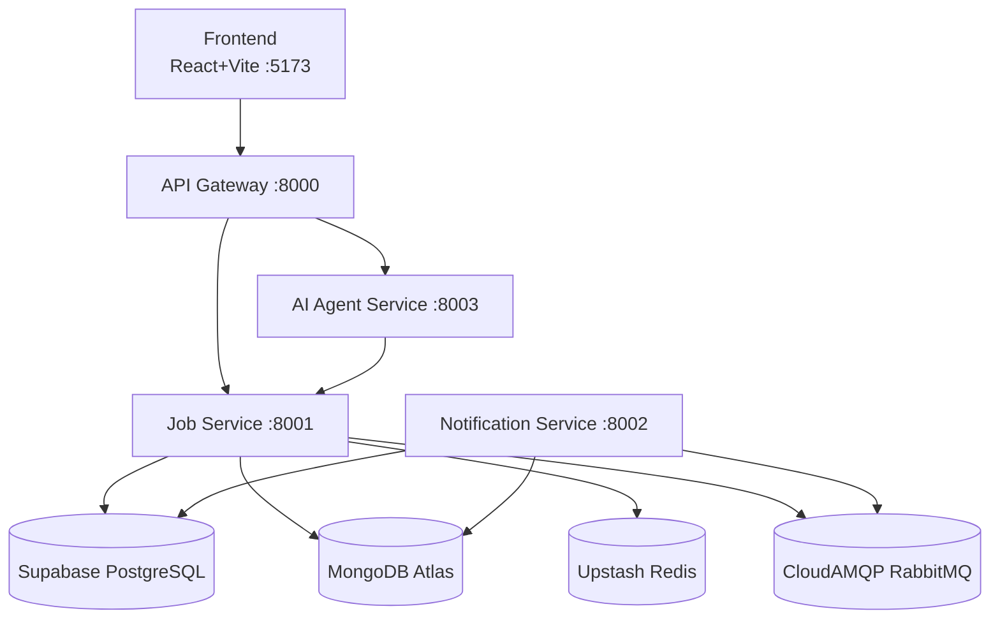
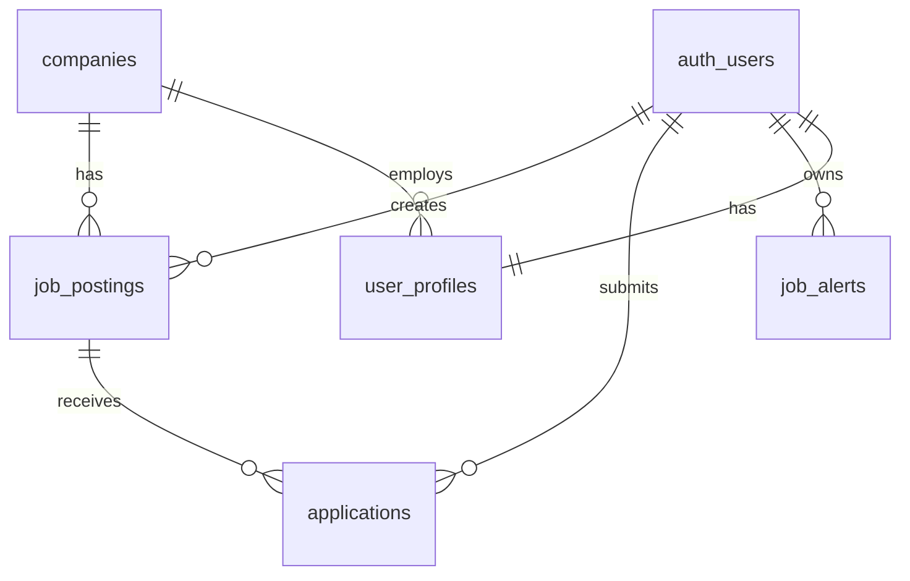

# JobSearch — SE4458 Final Project

Kariyer.net benzeri iş arama platformu. Microservice mimarisi, FastAPI backend, React+Vite frontend.

## Architecture



## ER Diagram



## Services

| Service | Port | Description |
|---|---|---|
| api-gateway | 8000 | JWT validation + reverse proxy |
| job-service | 8001 | Job CRUD, search, alerts, notifications |
| notification-service | 8002 | APScheduler tasks + RabbitMQ consumer |
| ai-agent-service | 8003 | ReAct agent with function calling |
| frontend | 5173 | React + Vite SPA |

## Quick Start

### Prerequisites
- Python 3.11+
- Node 18+
- Docker & Docker Compose
- LM Studio running on `http://localhost:1234` (for AI agent)

### 1. Environment Setup
```bash
cp .env.example .env
# Fill in all values in .env
```

### 2. Database Migration
Run `infra/sql/migration_initial.sql` in Supabase SQL Editor.

### 3. Run with Docker Compose
```bash
docker-compose up --build
```

### 4. Run Locally (Development)
```bash
# Job Service
cd backend/job-service && pip install -r requirements.txt
uvicorn app.main:app --port 8001 --reload

# Notification Service
cd backend/notification-service && pip install -r requirements.txt
uvicorn app.main:app --port 8002 --reload

# AI Agent Service (requires LM Studio)
cd backend/ai-agent-service && pip install -r requirements.txt
uvicorn app.main:app --port 8003 --reload

# API Gateway
cd backend/api-gateway && pip install -r requirements.txt
uvicorn app.main:app --port 8000 --reload

# Frontend
cd frontend && npm install && npm run dev
```

## Deployed URLs

> TODO: fill after Azure App Service deployment

- API Gateway: `https://...`
- Job Service: `https://...`
- Frontend: `https://...`

## Assumptions & Notes

- AI Agent Service (`ai-agent-service`) uses LM Studio with a local LLM. It must run locally — it cannot be deployed to Azure App Service without a GPU instance. README will be updated with Azure ML endpoint if needed.
- Notifications are stored in MongoDB only (no real email/SMS).
- RLS policies enforce row-level authorization at the database layer; backend services use `SUPABASE_SERVICE_ROLE_KEY` to bypass RLS where needed (e.g., notification matching).

## Demo

[Demo Videosu](https://drive.google.com/file/d/1MaoLx-B4GFg3OQzQM5_TBRTM3NmlkCPT/view?usp=drive_link)

---

*SE4458 — Spring 2025*
